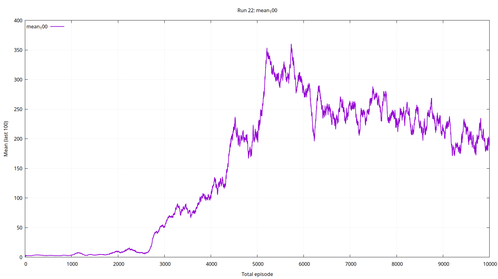

# Occupancy Racer -- Soft Actor-Critic v2

Async SAC reinforcement learning agent that trains on 2D occupancy grid maps and deploys on an F1Tenth robot with Jetson Orin Nano. Full 360-degree configurable LiDAR, 14 domain randomization features, and multi-zone spawn system for sim-to-real transfer.



---

## Key Features

- **Async multi-process training** -- 32 CPU actor processes feeding a central GPU learner via shared queues
- **Configurable 360-degree LiDAR** -- front hemisphere at 0.5-degree (361 rays) + rear at 2-degree (89 rays) = 450 total rays, or legacy 27-ray mode
- **14 domain randomization features** -- physics, surface, observation noise, control delays, action noise, wind gusts, battery sag, sensor drift, and more
- **Multi-zone spawn system** -- up to 3 spawn/lookat zone pairs per map with zone-aware heading
- **Sim-to-real bridge** -- complete inference pipeline for ROS2 + Jetson deployment
- **Ackermann physics model** -- servo lag (50ms), motor lag (100ms), tire slip, quadratic drag, yaw inertia
- **Interactive GUI tools** -- zone painter with eraser mode, PGM outline processor

---

## Architecture

```
src/train_ssac.py           Async training (primary): central learner + N actor processes
src/train.py                Sync training (legacy): single-process VecRacerEnv
src/game.py                 Interactive mode (pygame, human or RL control)
        |
src/rl_agent.py             SAC agent (GaussianPolicy, twin QNetwork w/ LayerNorm, ReplayBuffer)
src/racer_env.py            RL environment (configurable LiDAR, physics, reward, obstacles, zones)
src/vehicle.py              Ackermann vehicle model (servo/motor lag, tire slip, yaw inertia)
src/map_loader.py           PGM map + multi-zone overlay (3 zone IDs per channel)
src/sim_config.py           Domain randomization config builder
        |
sac_driver/                 Sim-to-real bridge (inference on Jetson, ROS2 integration)
  inference_engine.py       Load policy, run deterministic inference
  policy_loader.py          Standalone policy loader (auto-infer architecture)
  lidar_converter.py        ROS2 LaserScan -> training-format LiDAR
  state_builder.py          Frame-stacked state vector builder
  control_mapper.py         Policy actions -> Ackermann/Twist commands
```

### Training Data Flow

```
[32 Actor Processes] --transitions--> [mp.Queue] --drain--> [Replay Buffer (1M)]
        ^                                                           |
        |                                                      sample()
        |                                                      pin_memory()
        |                                                           |
        |                                                    [GPU Learner]
        |                                                  (SAC update, UTD~1.0)
        |                                                           |
        +<------------- weights_queues (per-actor mp.Queue) -------+
```

1. **Observation**: Configurable LiDAR (450 or 27 rays) + speed + steering + collision flag + IMU = N values per frame. With 4-frame stacking = state vector (1820-dim at 450 rays, 128-dim at 27 rays).
2. **Action**: GaussianPolicy outputs 2D continuous action (steering, acceleration) via tanh squashing.
3. **Reward**: Alignment with track direction + forward speed + wall clearance penalties + collision (-20).
4. **Learning**: Twin critics with LayerNorm, automatic entropy tuning with alpha bounds, soft target update.

---

## Quick Start

```bash
git clone https://github.com/Beba-ai-ml/occupancy-racer-sac2.git
cd occupancy-racer-sac2
python3 -m venv .venv
source .venv/bin/activate
pip install -r requirements.txt
python run.py               # Interactive mode (pygame)
```

### Training

```bash
# Async training (primary) -- 450-ray LiDAR, 40 maps
python -m src.train_ssac --config-file config/config_sac_20.yaml --session-id MyRun --no-resume

# Sync training (legacy, 27-ray)
python -m src.train --config config/game.yaml --physics config/physics.yaml
```

### Controls (Interactive Mode)

| Key | Action |
|-----|--------|
| W/S | Accelerate / Brake |
| A/D | Steer left / right |
| Mouse wheel | Zoom in/out |
| ESC | Quit |

---

## Configuration

### config/config_sac_20.yaml (Current Primary)

The main training config for 450-ray LiDAR with 40-map rotation:

| Parameter | Value | Description |
|-----------|-------|-------------|
| `lidar_front_step_deg` | 0.5 | Front hemisphere angular step (361 rays) |
| `lidar_rear_step_deg` | 2.0 | Rear hemisphere angular step (89 rays) |
| `hidden_sizes` | [512, 512, 256] | Network layer sizes (~6.65M total params) |
| `num_actors` | 32 | CPU actor processes |
| `memory_size` | 1000000 | Replay buffer entries (~14.6 GB) |
| `batch_size` | 256 | Mini-batch size |
| `gamma` | 0.99 | Discount factor |
| `tau` | 0.005 | Target network smoothing |
| `policy_lr` / `q_lr` | 0.0003 | Actor / Critic learning rate |
| `alpha_lr` | 0.0001 | Entropy coefficient learning rate |
| `grad_clip` | 0.5 | Gradient norm clipping |
| `alpha_min` / `alpha_max` | 0.05 / 0.3 | Entropy coefficient bounds |
| `target_entropy` | -1.5 | Multi-task entropy target (default -2.0 is single-task) |
| `action_repeat` | 8 | Decision rate: 8Hz at 60fps (matches real LiDAR) |
| `stack_frames` | 4 | Frame stacking depth |
| `map_switch_every` | 15 | Episodes between map rotation |
| `episode_time_limit_s` | 90 | Max episode duration |

### config/physics.yaml (Vehicle Physics)

| Parameter | Value |
|-----------|-------|
| `max_speed` | 4.0 m/s (~14.4 km/h) |
| `acceleration` | 2.0 m/s^2 |
| `brake_deceleration` | 3.5 m/s^2 |
| `max_steer_angle` | 20 degrees |
| `friction` | 0.6 |
| `vehicle size` | 0.45 x 0.30 m |

---

## LiDAR System

Two modes, selected by config:

**High-resolution 360-degree** (config_sac_20):
- Front hemisphere (0-180 degrees): 0.5-degree steps = 361 rays
- Rear hemisphere (180-360 degrees): 2-degree steps = 89 rays
- Total: 450 rays, full surround awareness
- Reward function uses only forward hemisphere (0-180 degrees) for left/right/front clearance groups

**Legacy 27-ray** (no lidar config or older configs):
- 210-degree arc centered at vehicle front
- Dense region: 5-degree steps within +/-45 degrees (19 rays)
- Sparse region: 15-degree steps outside (8 rays)

Both modes: max range 20m, output normalized to [0, 1].

---

## Map System

Maps are PGM occupancy grids (51 maps included) with optional zone overlays:

- **White pixels** (>= 250): driveable free space
- **Dark pixels**: walls/obstacles
- **Zone overlay**: `{map_name}_zones.png` with RGBA channels:
  - R: kill zones (episode terminates on entry)
  - G: spawn zones (up to 3 zone IDs via intensity: 255/170/85)
  - B: lookat zones (vehicle faces toward these, matched by zone ID)
  - A: raceline (reserved)

### Zone Painter

```bash
python -m tools.map_zone_painter
```

GUI tool for painting spawn, lookat, kill, and raceline zones. Supports 3 zone IDs with distinct overlay colors. **Eraser mode** clears all layers at once. Undo/redo per stroke.

---

## Domain Randomization

14 features for sim-to-real transfer, configured in `game.yaml` sim_randomization:

| Feature | Category | What it does |
|---------|----------|--------------|
| S1-S2 | Actuator lag | Servo 50ms, motor 100ms first-order filters |
| S4 | Tire slip | Grip degrades above 4 m/s (min_grip=0.4) |
| S5 | Quadratic drag | v^2 aerodynamic drag |
| S6 | LiDAR sim | Beam divergence, ego-motion blur |
| S7 | IMU | Linear accel + angular velocity channels |
| S8 | Soft collision | 2 light contacts before hard collision |
| S10 | Sensor delay | Per-episode base with +/-1 frame jitter |
| S11 | Yaw inertia | 100ms low-pass on yaw rate |
| S12 | Wind/slope | Ornstein-Uhlenbeck gusts (temporally correlated) |
| S13 | Battery/friction | Continuous per-step sag and friction cycles |
| S14 | Thermal drift | Sensor thermal drift (OU process) |
| DR | Physics | Random scales on accel, brake, speed, friction, drag, steering |
| DR | Observation | Gaussian noise on LiDAR, speed, steering readings |
| DR | Control | Action noise, steer/accel rate limits, delay steps |

---

## Training History

Key runs on 40-map pool:

| Run | Episodes | Peak m100 | Final m100 | Key change |
|-----|----------|-----------|------------|------------|
| Session 53 | 24,000 | **250m** | 250m | Baseline (10 maps, 27 rays, [256,256,128]) |
| Mapa_1_1 | 46,526 | 181m | 49m | 40 maps, no LayerNorm -- Q-divergence collapse |
| Mapa_1_2 | 31,384 | 307m | 119m | +LayerNorm, alpha_min=0.03 -- gradual forgetting |
| Mapa_1_3 | 26,000+ | 284m | 210m | +alpha_max=0.3, map_switch=15 -- slow decline |
| Mapa_1_4 | 41,222 | 131m | 60m | +stratified=true -- WORST (curriculum destroyed) |
| Mapa_3_3 | 8,401 | declining | declining | 450 rays, [512,512,256] -- Q-loss 38x divergence |

Current config (post Mapa_3_3): `grad_clip=0.5`, `alpha_min=0.05` to contain larger network gradient explosions.

---

## Entry Points

| Command | Description |
|---------|-------------|
| `python run.py` | Interactive mode (pygame) |
| `python -m src.train_ssac --config-file CONFIG` | Async multi-process training (primary) |
| `python -m src.train` | Synchronous training (legacy) |
| `python -m tools.map_zone_painter` | GUI zone painter |
| `python tools/pgm_outline_ui.py` | GUI PGM outline processor |

---

## Hardware

**Training machine**: AMD Ryzen 7 5700X (16 threads), 46 GB RAM, RTX 3080 10 GB VRAM.
With 450-ray config: ~28 GB RAM (14.6 GB buffer + 12.8 GB actors + queue).

**Target deployment**: Jetson Orin Nano 8 GB, ROS2, VESC ESC, RPLidar (8 Hz).

---

## License

MIT License. See [LICENSE](LICENSE) for details.
